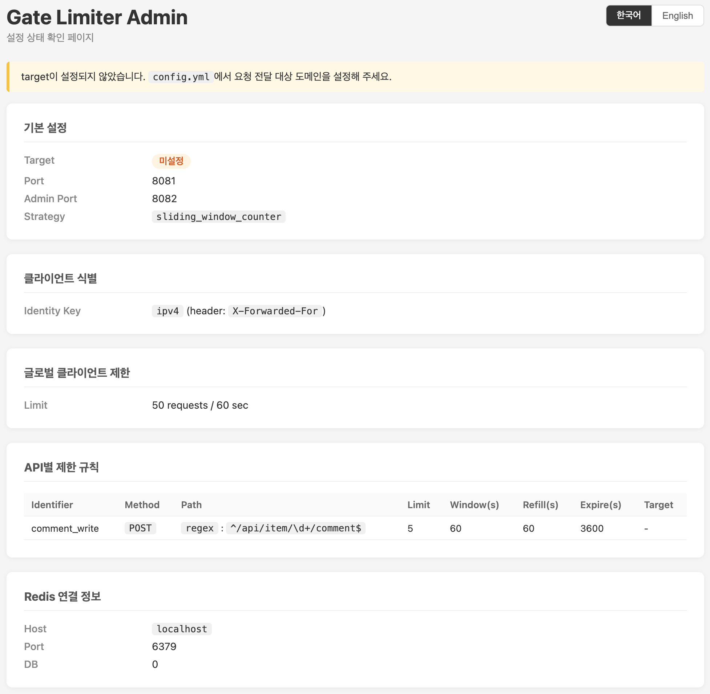

<h1 align="center">Gate Limiter</h1>

한국어 | [English](./README.md)

[](https://go.dev/doc/)
[](https://www.npmjs.com/package/@sapiensxxv/gate-limiter-cli)

[](https://hub.docker.com/repository/docker/sjhn/gate-limiter/general)

---

## 소개

**gate-limiter**는 API 남용을 방지하고 사용자 간 리소스 사용의 공정성을 보장하기 위해 설계된 구성형 레이트 리미팅 미들웨어입니다.
Go 언어로 작성되었으며, 다음 다섯 가지 레이트 리미팅 알고리즘을 제공합니다:

- Token Bucket
- Leaky Bucket
- Fixed Window Counter
- Sliding Window Log
- Sliding Window Counter

고부하 환경에서도 안정적으로 동작하도록 최적화되어 있으며, 배포가 간편하고 설정이 유연합니다.
Docker를 이용해 독립 실행형 서비스로 운영할 수 있고, RESTful API를 통해 요청 허용 여부를 실시간으로 판단할 수 있습니다.

---

## 설치

```bash
# Homebrew
brew tap sapiensXXV/gate-limiter
brew install gate-limiter

# NPM
npm install -g @sapiensxxv/gate-limiter-cli

# Docker
docker pull sjhn/gate-limiter:latest
```

---

## 빠른 시작

```bash
# 1. 기본 설정 파일 생성
gl init

# 2. config.yml을 환경에 맞게 수정
vi config.yml

# 3. 서버 시작
gl run
```

---

## CLI 사용법

### 커맨드

| 커맨드 | 설명 |
| --- | --- |
| `gl run` | 레이트 리미터 서버 시작 |
| `gl validate` | 설정 파일 유효성 검사 |
| `gl init` | 현재 디렉토리에 기본 `config.yml` 생성 |
| `gl version` | 버전, 커밋 해시, 빌드 날짜 출력 |

### 글로벌 플래그

| 플래그 | 단축 | 설명 |
| --- | --- | --- |
| `--config <path>` | `-c` | 설정 파일 경로 (기본값: `$GATE_LIMITER_CONFIG` 또는 `config.yml`) |

### `gl run` 플래그

| 플래그 | 단축 | 설명 |
| --- | --- | --- |
| `--daemon` | `-d` | 서버를 백그라운드에서 실행 (데몬 모드) |

### 환경 변수

| 변수 | 설명 |
| --- | --- |
| `GATE_LIMITER_CONFIG` | 설정 파일 경로. `-c` 플래그가 없을 때 사용되며, 미설정 시 `config.yml`로 대체됩니다. |

### 설정 파일 탐색 순서

1. `-c` / `--config` 플래그
2. `GATE_LIMITER_CONFIG` 환경 변수
3. 현재 디렉토리의 `config.yml`

### 사용 예시

```bash
# 서버 시작 (포그라운드)
gl run

# 특정 설정 파일로 서버 시작
gl run -c /etc/gate-limiter/config.yml

# 데몬 모드로 서버 시작 (백그라운드)
gl run -d

# 서버 시작 전 설정 검증
gl validate

# 특정 설정 파일 검증
gl validate -c production.yml

# 버전 확인
gl version
```

### 데몬 모드

`gl run -d`를 실행하면 서버가 백그라운드 프로세스로 시작되고, 즉시 터미널 제어를 반환합니다.

```
$ gl run -d
gate-limiter started (PID: 12345)
  server    : http://localhost:8081
  admin page: http://localhost:8082
  log       : gl.log
  pid       : gl.pid
```

| 파일 | 설명 |
| --- | --- |
| `gl.pid` | 백그라운드 프로세스의 PID 저장 |
| `gl.log` | 서버 로그 출력 (stdout/stderr) |

데몬 종료:

```bash
kill $(cat gl.pid)
```

---

## Docker로 실행

### Docker Compose

```bash
git clone https://github.com/sapiensXXV/gate-limiter.git
cd gate-limiter/docker
docker compose up -d
```

* `config.yml` 파일은 프로젝트 루트에서 컨테이너 내부로 마운트됩니다.
* `GATE_LIMITER_CONFIG` 환경변수는 `docker-compose.yml`에 이미 정의되어 있습니다.
* `config.yml`의 `port`를 변경하면 `docker-compose.yml`의 포트 매핑도 함께 변경해야 합니다.

### Docker 이미지

```bash
docker run -d \
  -p 8081:8081 \
  -p 8082:8082 \
  -v /path/to/config.yml:/etc/gate-limiter/config.yml:ro \
  -e GATE_LIMITER_CONFIG=/etc/gate-limiter/config.yml \
  --name gate-limiter \
  sjhn/gate-limiter:latest
```

* `config.yml` 파일을 준비하여 컨테이너에 마운트해야 합니다.
* `GATE_LIMITER_CONFIG` 환경변수는 컨테이너 내부 설정 파일 경로를 가리켜야 합니다.
* `config.yml`의 `port` 또는 `adminPort`를 변경하면 `-p` 포트 매핑도 함께 변경해야 합니다.

---

## 설정

### Root 설정 (`RootRateLimiterConfig`)

| Key           | Type                                    | Description              |
| ------------- | --------------------------------------- | ------------------------ |
| `rateLimiter` | [RateLimiterConfig](#ratelimiterconfig) | 레이트 리미팅 설정 루트 객체 |
| `redis`       | [RedisClientConfig](#redisclientconfig) | Redis 클라이언트 설정       |

---

### RateLimiterConfig

| Key        | Type                              | Description                                                                                                       |
| ---------- | --------------------------------- | ----------------------------------------------------------------------------------------------------------------- |
| `strategy` | `string`                          | 알고리즘 선택 (`token_bucket`, `leaky_bucket`, `fixed_window_counter`, `sliding_window_counter`, `sliding_window_log`) |
| `identity` | [ClientIdentity](#clientidentity) | 클라이언트 식별 방식                                                                                                |
| `client`   | [ClientLimit](#clientlimit)       | 전역 클라이언트 레이트 제한                                                                                            |
| `apis`     | `[Api]`                           | API 단위 제한 규칙                                                                                                   |
| `target`   | `string`                          | 허용 요청 전달 대상 도메인 URL                                                                                         |
| `port`     | `int`                             | 서버 포트 (기본값: `8081`)                                                                                            |
| `adminPort`| `int`                             | Admin 상태 페이지 포트 (기본값: `8082`)                                                                                |

---

### ClientIdentity

| Key      | Type     | Description                            |
| -------- | -------- | -------------------------------------- |
| `key`    | `string` | 식별 기준 (`ipv4` 또는 `cookie`)         |
| `header` | `string` | 사용자 식별용 HTTP 헤더 (ipv4일 때만 필요) |

---

### ClientLimit

| Key             | Type  | Description  |
| --------------- | ----- | ------------ |
| `limit`         | `int` | 최대 요청 수   |
| `windowSeconds` | `int` | 시간 윈도우(초) |

---

### Api

| Key             | Type                                | Description          |
| --------------- | ----------------------------------- | -------------------- |
| `identifier`    | `string`                            | API 고유 식별자         |
| `path`          | [RateLimiterPath](#ratelimiterpath) | API 경로 정의           |
| `method`        | `string`                            | HTTP 메서드             |
| `limit`         | `int`                               | 요청 제한 수             |
| `windowSeconds` | `int`                               | 윈도우 시간              |
| `refillSeconds` | `int`                               | 토큰 리필 주기           |
| `expireSeconds` | `int`                               | 저장소 만료 시간          |
| `target`        | `string`                            | API별 전달 대상 (옵션)    |

---

### RateLimiterPath

| Key          | Type     | Description                  |
| ------------ | -------- | ---------------------------- |
| `expression` | `string` | 경로 표현 방식 (`regex`, `plain`) |
| `value`      | `string` | 경로 값                        |

---

### RedisClientConfig

| Key        | Type     | Description    |
| ---------- | -------- | -------------- |
| `host`     | `string` | Redis 서버 주소  |
| `port`     | `int`    | Redis 포트      |
| `password` | `string` | Redis 비밀번호   |
| `db`       | `int`    | Redis DB 인덱스  |

---

## Admin 페이지

Gate Limiter는 별도 포트에서 설정 상태를 한눈에 확인할 수 있는 Admin 페이지를 제공합니다.



- **기본 URL**: `http://localhost:8082`
- **포트 설정**: `config.yml`의 `rateLimiter.adminPort` (기본값: `8082`)

Admin 페이지에서 확인할 수 있는 정보:

| 항목 | 내용 |
| --- | --- |
| **상태 요약** | `target` 설정 여부 (미설정 시 경고 표시) |
| **기본 설정** | Target URL, 서버 포트, Admin 포트, 전략(알고리즘) |
| **클라이언트 식별** | 식별 기준 (`ipv4` / `cookie`), 헤더 이름 (ipv4일 때) |
| **글로벌 클라이언트 제한** | `limit`, `windowSeconds` (미설정 시 "없음") |
| **API별 제한 규칙** | identifier, method, path (expression + value), limit, windowSeconds, refillSeconds, expireSeconds, target |
| **Redis 연결 정보** | host, port, DB index (비밀번호는 표시하지 않음) |

---

## 예시 설정 시나리오

각 설정 예시는 실제 서비스 환경에서 사용 가능한 구조를 기반으로 합니다.

1. 전역 클라이언트 제한 + API별 보호
2. 민감 API 보호 구조 (로그인/결제)
3. 고트래픽 공개 API (Burst 허용)
4. 무거운 API용 큐 기반 트래픽 제어


### 1. 전역 클라이언트 제한 + API별 제한

**상황 설명:**
전체 사용자 트래픽은 분당 50회로 제한하면서, 댓글 작성 API는 남용 방지를 위해 분당 5회만 허용하는 구조

```yml
rateLimiter:
  strategy: sliding_window_counter
  identity:
    key: ipv4
    header: X-Forwarded-For

  # 전역 클라이언트 제한
  client:
    limit: 50
    windowSeconds: 60

  # API별 제한
  apis:
    - identifier: comment_write
      path:
        expression: regex
        value: ^/api/item/\d+/comment$
      method: POST
      limit: 5
      windowSeconds: 60
      refillSeconds: 60
      expireSeconds: 3600

  # 통과된 요청을 백엔드 서비스로 전달
  target: https://mywebsitedomain.com
  port: 8081  # 기본값

redis:
  host: localhost
  port: 6379
  password:
  db: 0
```

* 클라이언트(IPv4 기준)당 적용:
  * **분당 최대 50회 요청** (전역 제한)
  * **분당 최대 5회 POST 요청** (`/api/item/{id}/comment`)
* 통과된 요청은 `https://mywebsitedomain.com`으로 전달
* Redis를 레이트 리미팅 카운터의 공유 저장소로 사용

---

### 2. 민감 API 보호 구조 (전역 제한 없음, API별 제한만)

**상황 설명:**
전체 트래픽은 제한하지 않고, 로그인·결제 등 민감 API만 보호하는 구조

```yml
rateLimiter:
  strategy: fixed_window_counter
  identity:
    key: cookie

  apis:
    - identifier: login_api
      path:
        expression: plain
        value: /api/auth/login
      method: POST
      limit: 5
      windowSeconds: 60
      expireSeconds: 600

    - identifier: payment_api
      path:
        expression: plain
        value: /api/payment
      method: POST
      limit: 3
      windowSeconds: 60
      expireSeconds: 600

  target: https://api.myservice.com

redis:
  host: redis
  port: 6379
  db: 0
```

* HMAC 서명 쿠키 기반 클라이언트 식별
* 로그인 API: 분당 **최대 5회**
* 결제 API: 분당 **최대 3회**
* 전역 클라이언트 제한 없음
* 민감 엔드포인트 중심의 API 남용 방지

---

### 3. 고트래픽 공개 API (Token Bucket)

**상황 설명:**
Burst 트래픽을 허용하면서 평균 처리량을 제한하는 구조 (공개 API, 외부 클라이언트)

```yml
rateLimiter:
  strategy: token_bucket
  identity:
    key: ipv4
    header: X-Forwarded-For

  apis:
    - identifier: public_api
      path:
        expression: plain
        value: /api/public/data
      method: GET
      limit: 100        # 버킷 크기
      refillSeconds: 10 # 10초마다 리필
      windowSeconds: 10
      expireSeconds: 600

  target: https://public-api.service.com

redis:
  host: localhost
  port: 6379
  db: 0
```

* Burst 트래픽 허용 (최대 100건 즉시 처리)
* 10초마다 토큰 리필
* 공개 API에 적합한 부드러운 레이트 제어
* CDN 기반 API나 오픈 서비스에 이상적

---

### 4. 큐 기반 트래픽 제어 (Leaky Bucket)

**상황 설명:**
요청을 버리지 않고, 고정 처리 속도를 강제하는 구조 (ML API, 고부하 처리 엔드포인트)

```yml
rateLimiter:
  strategy: leaky_bucket
  identity:
    key: cookie

  apis:
    - identifier: heavy_api
      path:
        expression: plain
        value: /api/ml/process
      method: POST
      limit: 20
      windowSeconds: 1
      expireSeconds: 600

  target: https://ml-backend.service.com

redis:
  host: localhost
  port: 6379
  db: 0
```

**의미:**

* 요청을 큐에 넣고 순서대로 처리
* 고정 속도로 처리
* 오버플로우 요청은 드롭
* 고부하 작업의 트래픽 스무딩

## 알고리즘

Gate Limiter는 다음 알고리즘을 지원합니다:

* Token Bucket
* Leaky Bucket
* Fixed Window Counter
* Sliding Window Log
* Sliding Window Counter

설정 경로:

```yml
rateLimiter.strategy
```

---

### Token Bucket

요청마다 토큰을 소비하며, 토큰이 존재하면 요청을 허용하고 없으면 거부합니다.
토큰은 일정 주기마다 자동으로 보충됩니다.

Parameters:

* Bucket size → `rateLimiter.apis.limit`
* Refill interval → `rateLimiter.apis.refillSeconds`

---

### Leaky Bucket

고정 처리 속도로 요청을 큐(Go channel 모델) 기반으로 처리합니다.
큐가 가득 차면 요청은 드롭됩니다.

Parameters:

* Queue size → `rateLimiter.apis.limit`
* Processing interval → `rateLimiter.apis.windowSeconds`

---

### Fixed Window Counter

고정된 시간 윈도우 단위로 요청 수를 카운팅합니다.

Rules:

* 요청마다 카운터 증가
* counter ≥ limit → 요청 거부
* counter < limit → 요청 허용

Parameters:

* Window size → `rateLimiter.apis.limit`
* Window duration → `rateLimiter.apis.windowSeconds`

---

### Sliding Window Log

요청 타임스탬프를 저장하고, 이동하는 시간 윈도우 내 요청 수를 기준으로 판단합니다.

Rules:

* 만료된 타임스탬프 제거
* count < limit → 요청 허용
* count ≥ limit → 요청 거부

Parameters:

* Window size → `rateLimiter.apis.limit`
* Window duration → `rateLimiter.apis.windowSeconds`

---

### Sliding Window Counter

고정 윈도우와 슬라이딩 윈도우를 결합한 방식으로,
이전 윈도우와 현재 윈도우 간 가중치 기반 근사 계산(weighted approximation)을 사용합니다.

Parameters:

* Window size → `rateLimiter.apis.limit`
* Window duration → `rateLimiter.apis.windowSeconds`

---

## 작성자

* Jaehoon So
* Email: [jhspacelover@naver.com](mailto:jhspacelover@naver.com)

---

## 라이선스

`gate-limiter`는 **MIT License**로 배포됩니다.
자세한 내용은 [LICENSE](https://github.com/sapiensXXV/gate-limiter/blob/main/LICENSE) 파일을 참고하세요.
